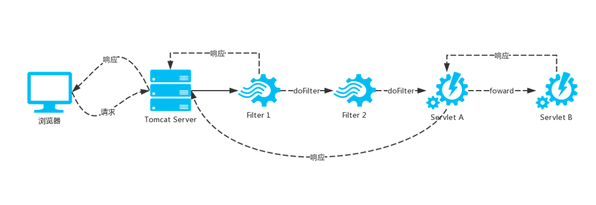

# 传统 Servlet 在  Spring 中的应用

## Servlet介绍


> 框架是帮助你实现某种功能的，但是中间发生什么事情，换一种技术能不能解决
>
> Servlet 是一种基于Java 技术的 Web 组件，用于生成**动态内容**，由容器管理。类似于其他
> Java 技术组件，Servlet 是平台无关的Java 类组成，并且由 Java Web 服务器加载执行。通常情况，由 Servlet 容器提供运行时环境。Servlet 容器，有时候也称作为 Servlet 引擎，作为Web服务器或应用服务器的一部分。通过请求和响应对话，提供Web 客户端与 Servlets交互的能力。容器管理Servlets实例以及它们的生命周期。

> 动态内容: 内容通常需要计算


   

> http与servlet的关系
>
> http中包含了host,url,path.method等信息，http发送请求后，servlet负责解析这些内容，
>
> 同时servlet也自己实现了一些东西。


> servlet 是标准，契约（api    编程的模式）。按照一定的规范，操作API.
>
> servlet 是j2EE规范的一部分

## servlet api history


> servlet 2.3 :增加了filter
>
> servlet2.5:增加了注解方式
>
> servlet3.0: 增加异步驱动方式，可插拔式，安全
>
> servlet3.1: nio

## Servlet组件


#### serlvet请求流向



#### servlet的三大组件

> Servlet
>
> Filter
>
> Listener


##### Listener接口


#### spring 运用


##### dispatcherServlet

> 前端总控制器
>
> 出现地方： https://docs.spring.io/spring/docs/1.0.0/javadoc-api/
>
> 具体介绍：http://www.corej2eepatterns.com/


##### Listener之root webApplicationContext创建

servletContext对象是web应用，web应用里面对应的多个servlet

ServletContextListener 

```java
public interface ServletContextListener extends EventListener {
    void contextInitialized(ServletContextEvent var1);

    void contextDestroyed(ServletContextEvent var1);
}
```

ContextLoaderListener

```java
public class ContextLoaderListener extends ContextLoader implements ServletContextListener {
    	public void contextInitialized(ServletContextEvent event) {
		initWebApplicationContext(event.getServletContext());
	}

}

	public WebApplicationContext initWebApplicationContext(ServletContext servletContext) {
		if (servletContext.getAttribute(WebApplicationContext.ROOT_WEB_APPLICATION_CONTEXT_ATTRIBUTE) != null) {
			throw new IllegalStateException("");
		}
		try {
			if (this.context == null) {
				this.context = createWebApplicationContext(servletContext);
			}
servletContext.setAttribute(WebApplicationContext.ROOT_WEB_APPLICATION_CONTEXT_ATTRIBUTE, this.context);
	}

```

##### Servlet之servlet webApplicationContext创建


###### FrameworkServlet内省

```xml
       <servlet-name>springmvc</servlet-name>
        <servlet-class>
            org.springframework.web.servlet.DispatcherServlet
        </servlet-class>
        <init-param>
            <param-name>contextConfigLocation</param-name>
            <param-value>classpath:/spring-mvc.xml</param-value>
            <param-name>namespace</param-name>
            <param-value></param-value>
        </init-param>
```

```java
public abstract class FrameworkServlet extends HttpServletBean {
    	/** WebApplicationContext id to assign */
	private String contextId;

	/** Namespace for this servlet */
	private String namespace;

	/** Explicit context config location */
	private String contextConfigLocation;
}
```

###### servlet webApplicationContext创建

HttpServletBean

```java
	public final void init() throws ServletException {
		if (logger.isDebugEnabled()) {
			logger.debug("Initializing servlet '" + getServletName() + "'");
        }

		// Let subclasses do whatever initialization they like.
		initServletBean();
	}
```

FrameworkServlet

```java
	@Override
	protected final void initServletBean() throws ServletException {
		try {
			this.webApplicationContext = initWebApplicationContext();
			initFrameworkServlet();
		}
		catch (ServletException ex) {
			this.logger.error("Context initialization failed", ex);
			throw ex;
		}
		catch (RuntimeException ex) {
			this.logger.error("Context initialization failed", ex);
			throw ex;
		}

	}
```

```java

protected WebApplicationContext initWebApplicationContext() {
    //root 	WebApplicationContext
		WebApplicationContext rootContext =
				WebApplicationContextUtils.getWebApplicationContext(getServletContext());
		WebApplicationContext wac = null;
		if (this.webApplicationContext != null) {
			wac = this.webApplicationContext;
			if (wac instanceof ConfigurableWebApplicationContext) {
				ConfigurableWebApplicationContext cwac = (ConfigurableWebApplicationContext) wac;
				if (!cwac.isActive()) {
					if (cwac.getParent() == null) {
                          //将root WebApplicationContext作为servletWebApplicationContext的父类
						cwac.setParent(rootContext);
					}
					configureAndRefreshWebApplicationContext(cwac);
				}
			}
		}
		return wac;
	}
```

